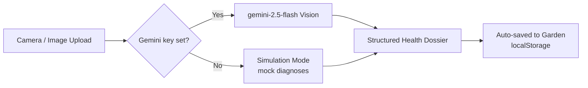

# <p align="center"><br />Petal & Parchment</p>

<p align="center">
  <strong>A Cozy, Whimsical Botanical Journal & AI Plant Diagnostics Web App</strong>
</p>

<p align="center">
  
  
  
  
  
</p>

---

## 🌸 Welcome to the Conservatory

**Petal & Parchment** is a mobile-first, single-page **web app** for identifying, diagnosing, and caring for your houseplants — styled like a cozy vintage botanical journal. It pairs warm, editorial visuals with Google's Gemini vision models to turn a leaf photo into a full health dossier.

Everything runs in the browser. Bring your own Gemini API key for live AI analysis, or explore the whole app in a built-in **Simulation Mode** with no key at all.


---

## ✨ Features

The app is organized into a bottom-nav set of screens ([`src/App.jsx`](src/App.jsx)):

### 🏡 Home — Conservatory Dashboard
Your saved "garden": a responsive grid of plant cards, each opening a detailed **Botanical Dossier** (health gauge, pathologist assessment, symptoms/causes, and a step-by-step treatment plan, plus a Care Guide tab). Scans are saved here automatically. Includes a light/dark theme toggle.

### 📸 Leaf Scanner (`src/components/Scanner.jsx`)
*   **Live camera or upload:** Uses your device camera via `getUserMedia`, or upload/drag-drop an image (auto-compressed before analysis).
*   **Real AI diagnosis:** With a Gemini key set, the photo is sent to `gemini-2.5-flash`, which returns a structured JSON health dossier.
*   **Simulation sandbox:** With no key, pick a demo species and a health scenario (healthy, overwatered, root rot, spider mites, etc.) and run a simulated scan — or run a simulated scan against your own uploaded photo. You can also paste a Gemini key inline from the scanner.

### 💬 Botanist Chat (`src/components/BotanistChat.jsx`)
Switch between **three distinct-personality specialists**, each with its own chat history:
*   🧑‍🔬 **Dr. Sage** — pathology, pests, treatments
*   🧪 **Flora** — soil mixes, watering, propagation
*   🌿 **Moss** — styling, light placement, companion plants

Open a plant's dossier and tap *Consult* to ground the conversation in that plant's diagnosis. Replies come from Gemini (`gemini-1.5-flash`) when a key **and** an active plant are present; otherwise the app serves built-in mock responses so chat still works offline. A client-side guard blocks basic prompt-injection attempts.

### 📔 Care Schedule (`src/components/CareTasks.jsx`)
A cozy lined-notebook checklist of daily rituals (watering, misting, pruning…) with a progress bar. *Note: this screen currently ships with a fixed sample task list for demonstration — it isn't yet linked to your saved plants or persisted.*

### ⚙️ Settings (`src/components/Settings.jsx`)
*   **Gemini key management** — save/clear your key (stored only in your browser's `localStorage`); a badge shows **Connected** vs **Simulation Active**.
*   **Theme** — Forest Fairy (light) / Night Forest (dark).
*   **Viewport mode** — Mobile Preview (phone frame) vs Responsive Web App (wide layout).
*   **Data management** — export a JSON backup, import a backup, seed sample plant profiles, or clear all data.

### 🔒 Local-First & Backward-Compatible
All data (garden, theme, layout, key) lives in `localStorage` — nothing is sent to any server except your own requests to Google's Gemini API. Legacy `verdant_` storage keys are automatically migrated to the `petal_parchment_` namespace on load, so older data is never lost.

---

## 🛠️ Technology Stack

*   **Framework:** React 19 + Vite (fast HMR and builds)
*   **Language:** JavaScript (JSX) — no TypeScript build step
*   **Styling:** Vanilla CSS driven by design tokens (CSS custom properties) for theming and glassmorphic blurs
*   **Icons:** Lucide React
*   **AI Engine:** Google Gemini via [`@google/generative-ai`](https://www.npmjs.com/package/@google/generative-ai), called **directly from the browser** with a user-supplied key (no backend/proxy)
*   **Hosting:** Deployed as a static SPA on Vercel

### Diagnostic Flow



---

## 🚀 Getting Started

### Prerequisites
[Node.js](https://nodejs.org/) **20.19+ or 22.12+** (required by Vite 8).

### 1. Clone & Install
```bash
git clone <your-repo-url>
cd plant-agent
npm install
```

### 2. Run the Dev Server
```bash
npm run dev
```
Open the local address shown (usually `http://localhost:5173`).

### 3. Add Your Gemini API Key (optional)
There is **no `.env` key** — the app does not read environment variables for the key. Instead, open **Settings** (or the Scanner's key panel) inside the app and paste a Gemini key from [Google AI Studio](https://aistudio.google.com/). It's saved to your browser's `localStorage`.

> Without a key, the app runs fully in **Simulation Mode** — great for a quick tour or an offline demo.

### 4. Build & Preview
```bash
npm run build     # optimized production bundle -> dist/
npm run preview   # serve the production build locally (matches Vercel)
```

### Available Scripts
| Script | Description |
| --- | --- |
| `npm run dev` | Start the Vite dev server with HMR |
| `npm run build` | Build the production bundle to `dist/` |
| `npm run preview` | Preview the production build locally |
| `npm run lint` | Run ESLint |

---

## 🎨 Theme Design System

Styling is driven by hex color tokens (CSS custom properties) in [`src/index.css`](src/index.css), swapped via a `data-theme` attribute:

```css
:root, [data-theme="light"] {
  --bg-app: #fbf9f6;             /* Warm soft clay porcelain off-white */
  --primary: #c5b4a5;            /* Cozy mushroom taupe */
  --secondary: #f9c3c3;          /* Peony blush pink */
  --gold: #f4e3c1;               /* Champagne gold */
  --text-main: #3a332e;          /* Rich espresso grey */
}

[data-theme="dark"] {
  --bg-app: #16110d;             /* Midnight espresso clay */
  --primary: #e2d7ce;            /* Luminous warm taupe */
  --secondary: #faa2a2;          /* Glowing peony blush */
  --gold: #f3dca2;               /* Glowing champagne gold */
  --text-main: #faf6f2;          /* Ivory porcelain white */
}
```

The app also supports two layout modes (a stylized phone frame and a wide responsive web layout), selectable in Settings and auto-detected from screen size.

---

## 📜 License

MIT License.

---

<p align="center">
  Crafted with love, botanical care, and cozy aesthetics 🌸✨
</p>
